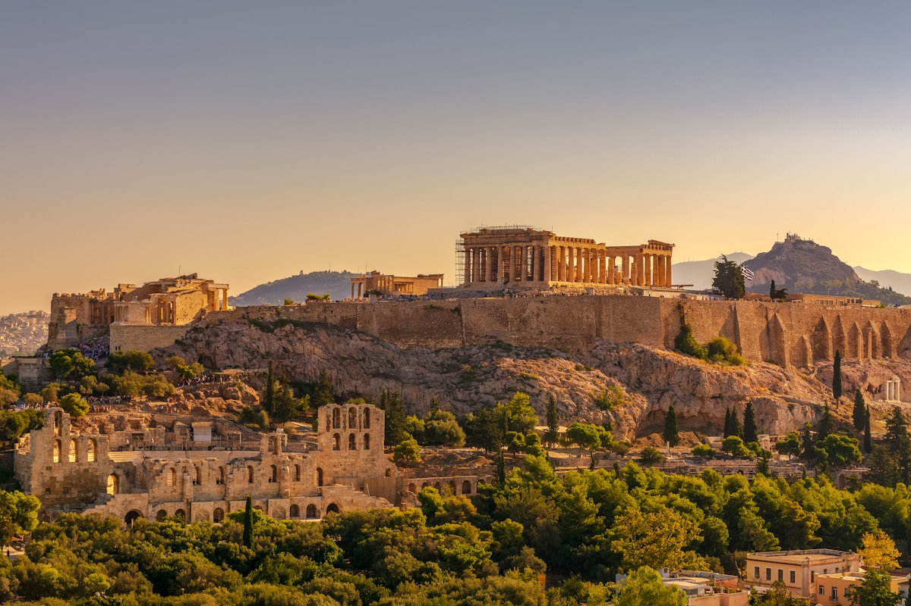

# Acropolis Museum

The Acropolis Museum is one of the world's greatest archaeological museums, purpose-built to house the treasures of the sacred rock of the Acropolis. Opened in 2009, this striking contemporary building designed by Swiss architect Bernard Tschumi spans 25,000 square meters across four levels, displaying over 4,000 artifacts that span from the Greek Bronze Age through Roman and Early Byzantine Athens.

What makes this museum extraordinary is its seamless connection to the Acropolis itself. The top floor—the Parthenon Gallery—is oriented exactly like the ancient temple, rotated 23 degrees from the rest of the building so visitors can gaze directly at the Parthenon through floor-to-ceiling glass walls while viewing its original sculptures. The building's glass floors on the ground level reveal ongoing archaeological excavations beneath your feet, creating an immersive journey through layers of Greek history.

For October 2026, the museum offers an ideal experience: smaller crowds compared to summer, comfortable indoor exploration away from any weather concerns, and extended Friday evening hours that allow you to dine with Acropolis views after dark.

## Who This is For

**Ryan & Toni**: This is a perfect museum compromise. Ryan will love the deep historical context and world-class artifact displays, while Toni (who prefers limited museum time) will appreciate that it's concise, visually stunning, and offers incredible photography opportunities—especially from the Parthenon Gallery with its direct Acropolis views. The architecture itself is worth seeing, and the rooftop restaurant provides an excellent photo spot. Note: No photography is allowed in the Archaic Gallery to protect ancient paint pigments.

**Andy & Kathy**: The museum is fully wheelchair accessible with elevators to all floors, wide pathways, and free wheelchairs available. It's climate-controlled (important for October when weather can be unpredictable), and the on-site restaurant means no need to leave for a comfortable lunch. The museum's friendly staff and organized layout make it easy to explore at your own pace.

**Donna & Travis**: While Spanish-language tours aren't standard, the museum offers audio guides and well-labeled exhibits that work for all visitors. The two women in their 80s in Donna's extended family will appreciate the accessibility features and benches throughout. The relaxed, self-paced experience fits well with avoiding rigid schedules.

**Everyone Together**: This is an excellent group activity—accessible to all ages and mobility levels, with enough depth to satisfy history buffs while remaining visually engaging for those who prefer shorter museum visits.

## Reasons to Choose

- **World-class museum experience**: Consistently rated as one of the best museums visitors have ever experienced, with thoughtfully displayed artifacts that bring ancient Athens to life
- **Perfectly complements the Acropolis**: Seeing the original sculptures, friezes, and Caryatids gives essential context to what you'll see on the hill above—many recommend visiting the museum first
- **Stunning architecture**: Glass floors reveal excavations beneath, and the Parthenon Gallery's orientation creates a direct visual dialogue with the ancient temple
- **Fully accessible**: Modern design with elevators, wide paths, and wheelchairs available—everyone in the group can enjoy it comfortably
- **Great restaurant with views**: The second-floor restaurant offers traditional Greek cuisine with panoramic Acropolis views—and you don't need a museum ticket to dine there

## Details

### Duration & Best Timing

Plan for **2-3 hours** to explore thoroughly without rushing. If combining with the Acropolis itself, budget 5-6 hours total for both.

**Best times to visit in October:**
- Early morning (museum opens at 9:00 AM) for smallest crowds
- Late afternoon (after 4:00 PM) when tour groups thin out
- **Friday evenings**: The museum stays open until 10:00 PM, and the restaurant until midnight—perfect for dinner with illuminated Acropolis views

October is considered optimal visiting season: fewer tourists than summer, pleasant temperatures, and the museum provides welcome climate control.

### Must-See Highlights

1. **The Parthenon Gallery (3rd Floor)**: The museum's crown jewel. A glass atrium housing the temple's 160-meter-long frieze, oriented to match the Parthenon itself. The gallery has the exact dimensions of the cella of the Parthenon, and through the windows, you can see the actual temple while viewing its original marbles.

2. **The Caryatids (1st Floor)**: Five of the six original female figures that once served as columns on the Erechtheion. Standing 7 feet 7 inches tall, each hand-carved from Parian marble with unique details. The sixth remains in the British Museum.

3. **Archaic Gallery (1st Floor)**: A forest of statues including stunning 6th-century *kore* (statues of young women in draped clothing with elaborate braids). No photography allowed here to protect ancient paint pigments.

4. **Glass Floor Excavations (Ground Level)**: See the ancient Athenian neighborhood being excavated directly beneath the building.

5. **Winged Nike & Alexander the Great Portrait**: Notable sculptures not to miss.

### Tips & Recommendations

- **Start from the top floor** (Parthenon Gallery) and work your way down—this tells a more coherent chronological story
- **Leave bags in the cloakroom**—large bags and backpacks aren't permitted in galleries
- **No food or drinks** in exhibition areas
- **Photography is allowed** everywhere except the Archaic Gallery
- **Buy tickets online** through the official site to skip ticket desk lines and use the priority entry lane
- **Consider a guided tour** if you want deeper context—they last about 90 minutes

### October-Specific Notes

- **October 28th is Oxi Day** (National Anniversary)—check for holiday hours or closures
- Weather can be unpredictable in October, making the climate-controlled museum a great backup plan
- Shoulder season means shorter lines and more space to appreciate exhibits

## Photos

*The striking contemporary glass architecture of the Acropolis Museum, designed by Bernard Tschumi*

*Five original Caryatids from the Erechtheion displayed in the Acropolis Museum since 2009*

## Logistics

### Hours of Operation (October/Summer Season)

| Day | Hours | Last Entry |
|-----|-------|------------|
| Monday | 9:00 AM - 5:00 PM | 4:30 PM |
| Tuesday - Thursday | 9:00 AM - 8:00 PM | 7:30 PM |
| Friday | 9:00 AM - 10:00 PM | 9:30 PM |
| Saturday - Sunday | 9:00 AM - 8:00 PM | 7:30 PM |

**Restaurant Hours**: Open from noon daily; stays open until midnight on Fridays and Saturdays.

### Address

**Acropolis Museum**
Dionysiou Areopagitou 15, Athens 117 42, Greece

[View on Google Maps](https://www.google.com/maps/place/Acropolis+Museum/@37.9685,23.7286,17z)

### Cost

| Ticket Type | Price |
|-------------|-------|
| General Admission (Apr-Oct) | €15 |
| Reduced Admission | €10 |
| Winter Season (Nov-Mar) | €10 / €5 reduced |
| Children under 5 | Free |
| Persons with disabilities + companion | Free (at ticket desk) |

**Combination Option**: €83 for Acropolis + Acropolis Museum + National Archaeological Museum (includes audio tours for all three; must visit same day).

**Note**: The museum ticket is separate from the Acropolis Combined Ticket (€30) that covers archaeological sites.

### How to Get There

- **On foot**: 10-minute walk from Plaka/Monastiraki through pedestrianized streets
- **Metro**: Acropolis station (Line 2, Red Line)—museum is directly adjacent
- **From Piraeus Port**: Metro Line 1 to Omonia, transfer to Line 2 to Acropolis (~45 min)

### Booking Requirements

- **Advance booking recommended** but not required
- Buy tickets at [official e-ticketing site](https://etickets.theacropolismuseum.gr/) to skip lines
- **Beware of fraudulent sites**—only use domains ending in ".gr" (not ".org")
- Restaurant reservations recommended for Friday/Saturday dinner

### Accessibility Features

- Wheelchair ramps at both entrances
- Elevators to all floors
- Wide, level pathways throughout
- Free wheelchairs available upon request
- Disabled parking available with advance arrangement
- Guide dogs permitted

## References

- [Acropolis Museum Official Website](https://www.theacropolismuseum.gr/en)
- [Plan Your Visit - Official](https://www.theacropolismuseum.gr/en/plan-your-visit)
- [Official E-Ticketing](https://etickets.theacropolismuseum.gr/)
- [Museum Restaurant - Official](https://www.theacropolismuseum.gr/en/restaurant)
- [Athens by Locals - Insider Tips](https://athensbylocals.com/acropolis-museum/)
- [Lonely Planet - Acropolis Museum](https://www.lonelyplanet.com/greece/athens/acropolis-area/attractions/acropolis-museum/a/poi-sig/1008048/1342281)
- [Accessibility Guide - Disabled Accessible Travel](https://disabledaccessibletravel.com/accessibility-acropolis-and-museum/)
- [Why Athens - Photo Story](https://whyathens.com/the-acropolis-museum/)
