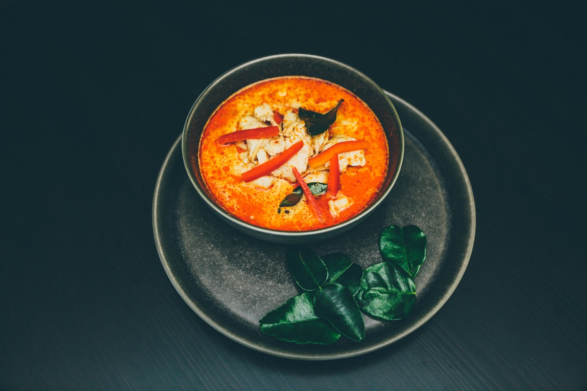

# Food Tours

Athens offers some of the best food tours in the Mediterranean, taking visitors on a culinary journey through bustling markets, hidden tavernas, and artisanal specialty shops. The heart of the Athenian food scene centers around the Varvakios Agora (Central Market), where butchers, fishmongers, and produce vendors have been serving locals for over a century. Most food tours wind through historic neighborhoods like Plaka, Monastiraki, and Psyrri, stopping at family-run establishments that have perfected their craft over generations.

A typical Athens food tour spans 3-5 hours and includes 10-20+ tastings. You'll sample iconic Greek dishes like spanakopita (spinach pie), tyropita (cheese pie), souvlaki, loukoumades (Greek donuts), and dolmades, along with premium Greek cheeses, olives, and olive oils. Many tours include wine or tsipouro tastings, and some end with a full mezze spread at a traditional taverna. The guides are often locals who share not just food, but the stories, history, and culture behind each bite.

October is an ideal time for Athens food tours. The oppressive summer heat has subsided (expect comfortable 22°C/72°F days), outdoor café seating is pleasant, and markets are stocked with autumn's harvest including fresh grapes, figs, and pomegranates. You'll also encounter fewer crowds than peak summer season.

## Who This is For

**Excellent for the entire group** - Food tours are explicitly listed in the global preferences, making this a perfect group activity during your initial days together in Athens.

- **Andy & Kathy (70, 68)**: Ideal match. Andy and Kathy specifically love food tours and "chatting it up with locals." The smaller group sizes (typically 6-10 people) create an intimate atmosphere for conversation. Most tours operate at an easy walking pace with frequent stops, making them accessible for seniors. The 3-hour morning tours are particularly manageable.

- **Ryan & Toni (38, 37)**: Excellent fit. Ryan's interest in olive oil tastings is addressed by several tours that include premium olive oil sampling. Many tours visit hole-in-the-wall establishments that match their "unique dining" preference. Photography opportunities abound at the colorful Varvakios market. Toni will appreciate the wine tastings included on several tours.

- **Donna & Travis (24, 32)**: Good fit. The relaxed, social nature of food tours aligns with their preference for avoiding rigid schedules. Note: For Donna's Spanish-speaking family members, Athens Food on Foot offers tours in multiple languages, and some guides are multilingual.

## Reasons to Choose

- **Directly matches group preferences**: Food tours are explicitly listed as a shared interest for the entire travel party
- **Perfect introduction to Greek cuisine**: Learn what to order and where to eat for the rest of your trip
- **Accessible activity**: Easy walking pace with frequent stops; no strenuous hiking or climbing
- **Social experience**: Small group sizes encourage conversation with guides and fellow food lovers
- **Covers multiple interests**: Combines food, history, culture, people-watching, and photography opportunities in one activity
- **Olive oil & wine tastings included**: Several tours feature the olive oil and wine tastings Ryan and Toni want
- **Great for the first day**: Perfect way to get oriented in Athens while fighting jet lag with food and activity

## Details

### Tour Duration & Best Timing

Tours range from 2-6 hours depending on the company:
- **Morning tours (9:00-10:00 AM start)**: Best for visiting Varvakios market when it's most active. Markets and vendors often close after lunchtime.
- **Afternoon/evening tours**: Better for experiencing Athens' vibrant street food and wine bar scene.

A 3-4 hour morning tour is ideal for the group, providing substantial food without being exhausting.

### What to Expect

A typical tour includes:
1. **Meeting point**: Usually near Omonia or Monastiraki Square
2. **Market exploration**: Stroll through Varvakios Agora seeing fish, meat, produce, and specialty vendors
3. **Multiple food stops**: 8-15 tastings at bakeries, delis, cheese shops, olive oil merchants, and tavernas
4. **Cultural context**: Guides explain Greek food traditions, regional specialties, and how locals eat
5. **Final meal**: Many tours end with a mezze spread accompanied by wine or tsipouro

### What You'll Taste

- Greek yogurt with honey and walnuts
- Koulouri (sesame bread rings)
- Spanakopita and tyropita (spinach and cheese pies)
- Premium Greek cheeses (feta, graviera, Cretan varieties)
- Cured meats and olives
- Extra virgin olive oil tastings
- Souvlaki and gyros
- Loukoumades (honey-drizzled doughnuts)
- Baklava and other sweets
- Greek coffee
- Wine, retsina, or tsipouro

### Tips & Recommendations

- **Come hungry**: Skip breakfast before a morning tour; you'll eat the equivalent of 2 meals
- **Wear comfortable shoes**: Cobblestone streets and marble market floors can be slippery
- **Bring a light layer**: Markets can be cooler inside
- **Bring cash**: Some tours include stops where you can purchase items (olive oil, honey, etc.)
- **Book in advance**: Popular tours sell out, especially in shoulder season
- **Communicate dietary needs**: Most tours accommodate vegetarians; vegan/gluten-free options may be limited

### October-Specific Notes

- October weather is ideal: warm but not hot, perfect for walking tours
- Markets are well-stocked with autumn produce (grapes, figs, pomegranates, chestnuts)
- **October 28 (Oxi Day)**: Some markets and vendors may be closed for this national holiday
- Smaller crowds than summer season means more personal attention from guides

## Logistics

### Top Tour Companies

| Company | Duration | Price (approx.) | Group Size | Best For |
|---------|----------|-----------------|------------|----------|
| [Athens Food on Foot](https://www.athensfoodonfoot.com/) | 3-4 hours | €52/person | Max 10 | Families, accessibility |
| [Culinary Backstreets](https://culinarybackstreets.com/food-tours/athens) | 5.5-6 hours | ~$135/person | Max 7 | In-depth experience |
| [Eating Europe](https://www.eatingeurope.com/athens/) | 3.5-4 hours | ~€90/person | Small groups | International company |
| [Greeking.me](https://greeking.me/tours/athens/athens-food-tour) | 4 hours | ~€80/person | Small groups | Evening/wine focus |

**Recommended for your group**: **Athens Food on Foot** offers the best balance of value, duration, and accessibility. Their tours are wheelchair accessible with an easy walking pace, offer multi-language options, and include a kids' discount (half price ages 6-11, free under 6).

### Hours of Operation

- Morning tours: Typically 9:00-10:00 AM start
- Afternoon/evening tours: Typically 4:00-5:00 PM start
- Varvakios Market is busiest in the morning and closes early afternoon

### Meeting Points

Most tours meet in central Athens:
- Omonia Square area
- Monastiraki Square
- Near the Church of the Virgin Mary Pantanassa (Eating Europe)

**Google Maps**: [Varvakios Central Market](https://www.google.com/maps/place/Varvakios+Central+Market/@37.9808,23.7243,17z)

### Cost Breakdown

- **Tour price**: €52-135 per person depending on company and duration
- **Children**: Many offer 50% discount (ages 6-11), free for under 6
- **Tips**: Optional but appreciated (€5-10 per person)
- **Extras**: Some tours include all food/drink; others charge for additional alcoholic beverages
- **Shopping**: Budget extra if you want to purchase olive oil, honey, or other products to take home

### Booking Requirements

- **Advance booking recommended**: 1-2 weeks ahead, especially for October weekends
- **Cancellation policy**: Most offer free cancellation up to 24 hours in advance
- **Dietary accommodations**: Request vegetarian, pescatarian, or gluten-free options at time of booking
- **Group bookings**: Private tours available for larger parties

### Getting There

Tours meet in central Athens, easily accessible by:
- **Walking**: 5-15 minutes from most Plaka/Monastiraki hotels
- **Metro**: Monastiraki or Omonia stations (Lines 1 & 3)
- **Taxi**: Affordable from anywhere in central Athens

## Photos

*Authentic Greek cuisine tasting featuring local cheeses, olives, and traditional dishes*

*Inside the bustling Varvakios Central Market on Athinas Street, operating since 1884*

*Traditional souvlaki—Greece's beloved street food dating back to ancient times*

*Premium Greek olive oil tasting, exploring regional varieties and flavor profiles*

## Related: Olive Oil & Wine Tastings

For Ryan and Toni's specific interest in olive oil tasting, consider these specialized options:

- **[Flavors of Greece: Olive Oil and Wine Tasting](https://www.byfood.com/experiences/flavors-of-greece-olive-oil-and-wine-tasting-tour-in-athens-8005)**: The only combined olive oil and wine tasting in Athens. Sample 4 premium EVOOs and 4 Greek wines.
- **[Greeking.me Olive Oil & Wine Day Trip](https://greeking.me/tours/athens/olive-oil-tour)**: Full-day trip from Athens including olive grove visit, Corinth Canal stop, and tastings.
- **[Private Olive Grove Experience](https://www.viator.com/tours/Athens/Olive-Oil-Tasting-and-Farm-Tour-in-Athens/d496-26368P54)**: Olive oil sommelier-led tasting at an actual grove.

## References

- [Athens Food on Foot - Official Site](https://www.athensfoodonfoot.com/)
- [Culinary Backstreets Athens Tours](https://culinarybackstreets.com/food-tours/athens)
- [Eating Europe Athens Food Tours](https://www.eatingeurope.com/athens/)
- [Greeking.me Athens Food Tours](https://greeking.me/tours/athens/athens-food-tour)
- [TripAdvisor: Best Athens Food Tours](https://www.tripadvisor.com/Attractions-g189400-Activities-c42-t204-Athens_Attica.html)
- [Athens Walking Tours - Food Tours](https://www.athenswalkingtours.gr/athens-tours/17-sat-6-athens-food-tour.html)
- [GetYourGuide: Athens Food on Foot Classic Tour](https://www.getyourguide.com/athens-l91/food-on-foot-classic-food-tasting-tour-in-athens-t145827/)
- [Context Travel Athens Food Tour](https://www.contexttravel.com/cities/athens/tours/athens-food-tour)
- [5 Lost Together: Athens Food on Foot Review](https://www.5losttogether.com/food-tour-athens-food-on-foot-review/)
