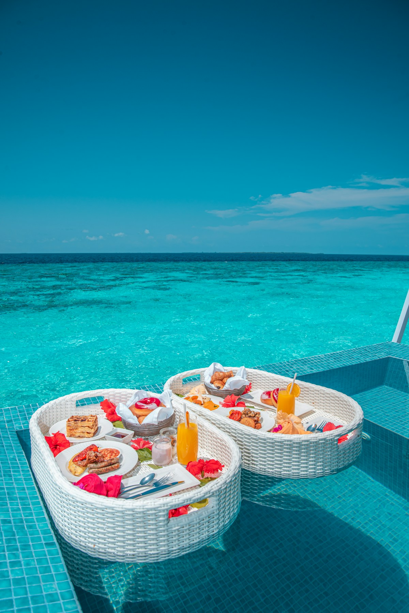

# Crete

Greece's largest island and the fifth largest in the Mediterranean, Crete offers an extraordinary blend of ancient history, stunning beaches, world-renowned cuisine, and charming Venetian harbors. At approximately 260 km (160 miles) long, Crete is a destination that rewards extended exploration.

## Why October is Perfect

October is an ideal time to visit Crete:
- **Weather**: 6-8 hours of daily sunshine, comfortable temperatures for sightseeing
- **Sea temperature**: Around 23°C (73°F) — perfect for swimming
- **Crowds**: Peak summer tourists have departed
- **Prices**: Lower flight and accommodation costs
- **Harvests**: Grape harvest in September, olive harvest beginning in November — wine and olive oil experiences abound

## Who This is For

**Andy and Kathy**: The island's relaxed pace, stunning harbor views in Chania, excellent people-watching opportunities, and accessible historical sites make it perfect for them. The Venetian harbors are ideal for leisurely strolls without strenuous activity.

**Ryan and Toni**: Crete delivers on fine dining and unique local cuisine. While the island doesn't have Michelin-starred restaurants (Greece's Michelin coverage is limited to Athens), exceptional culinary experiences abound — from traditional Cretan tavernas to upscale hotel restaurants. The photogenic Venetian harbors, pink sand beaches, and ancient ruins offer endless photography opportunities. Beaches like Elafonisi and Balos Lagoon offer the crystal-clear, turquoise water with incredible visibility that Ryan and Toni love. **This is a new destination for Toni**, offering fresh Greek island experiences beyond her previous visits. Ryan would enjoy the Palace of Knossos and Heraklion Archaeological Museum, while Toni might prefer spending that time exploring Chania's colorful streets and harbor—a good way to accommodate their different museum interests.

**Donna and Travis**: Chania's flat Old Town and waterfront are ideal for Donna's Spanish-speaking family (including two women in their 80s). The casual dining culture allows flexible meal times without strict reservations, fitting their preference to avoid rigid schedules. Many tour operators in Crete offer Spanish-language guides for major sites.

**All couples together**: Chania's Old Town provides a wonderful shared experience combining food tours, historical exploration, unique shopping (artisan crafts, local olive oil, Cretan knives—not luxury boutiques), and beautiful views — all without requiring strenuous hiking.

## Reasons to Choose

1. **Food capital of Greece**: Crete is considered the birthplace of the Mediterranean diet. Food tours, olive oil tastings, wine experiences, and cooking classes are abundant
2. **Accessible history**: The Palace of Knossos and Heraklion Archaeological Museum showcase 5,500 years of civilization without requiring difficult hikes
3. **Stunning beaches**: Elafonisi (pink sand) and Balos Lagoon consistently rank among the world's top beaches — still swimmable in October
4. **Venetian charm**: Chania's Old Town and harbor rival any picturesque European destination for atmosphere and people-watching
5. **Unique shopping**: Traditional Cretan knives, handmade ceramics, local honey, olive oil, and herbs make memorable souvenirs
6. **Perfect October weather**: Warm enough for beach days, cool enough for comfortable exploration

## Top Activities

- [Palace of Knossos & Heraklion Archaeological Museum](activities/knossos-museum.md) — Minoan civilization highlights
- [Chania Old Town & Venetian Harbor](activities/chania-old-town.md) — Venetian architecture, lighthouse, shopping
- [Food & Wine Tours](activities/food-wine-tours.md) — Culinary experiences across the island
- [Elafonisi Beach](activities/elafonisi-beach.md) — Famous pink sand beach
- [Balos Lagoon](activities/balos-lagoon.md) — Turquoise lagoon and dramatic scenery

## Details

### Recommended Bases

| Town | Best For | Notes |
|------|----------|-------|
| **Chania** | Charm, dining, photography | Venetian harbor, boutique hotels, best restaurant scene |
| **Rethymno** | Central location, compact charm | Another beautiful Venetian town, good day-trip base |
| **Heraklion** | History, convenience | Near Knossos, largest city, main airport |
| **Elounda/Agios Nikolaos** | Luxury, relaxation | Eastern Crete, upscale resorts |

### Suggested Duration

4-5 days minimum to experience the highlights. The island is large — driving from west to east takes 4-5 hours. Consider basing in one area rather than trying to see everything.

### Sample Itinerary (5 Days)

**Day 1**: Arrive in Chania, explore Old Town and Venetian Harbor, sunset dinner by the lighthouse
**Day 2**: Food tour of Chania, afternoon at nearby beach, evening stroll
**Day 3**: Day trip to Elafonisi Beach (pink sand), return via mountain villages
**Day 4**: Drive to Heraklion area, visit Knossos Palace and Archaeological Museum
**Day 5**: Balos Lagoon day trip (by boat from Kissamos) or relaxed morning before departure

## Photos

*The historic Venetian Harbor of Chania, built in the 14th century, featuring colorful waterfront buildings and the iconic Egyptian Lighthouse*

*The Egyptian Lighthouse, originally built by Venetians in the late 16th century and rebuilt by Egyptians in 1864*

*The partially reconstructed Palace of Knossos, the largest Bronze Age archaeological site on Crete and center of Minoan civilization*

*Elafonisi's famous pink sand beach, created by crushed red shells of microscopic foraminifera*

*The stunning Balos Lagoon with its shallow turquoise waters, protected under the Natura 2000 program*

*One of the best-preserved old towns in Crete, Rethymno features 16th-century Venetian architecture and narrow streets*

*Traditional Cretan meze featuring local specialties—representing one of the healthiest diets in the world*

## Logistics

### Getting There from Athens

| Method | Duration | Notes |
|--------|----------|-------|
| **Flight** | 45-55 min | Heraklion (HER) or Chania (CHQ) airports |
| **High-speed ferry** | 5-6 hours | From Piraeus to Heraklion |
| **Overnight ferry** | 8-9 hours | Cabin available, saves a night's accommodation |

**Recommendation**: Fly to save time during the vacation. October flight prices are reasonable.

### Getting Around

A rental car is highly recommended for exploring Crete's beaches and villages. Roads are generally good. Alternatively, organized tours can handle transportation for major attractions.

### Google Maps

- [Chania Old Town](https://maps.google.com/?q=Chania+Old+Town,+Crete,+Greece)
- [Palace of Knossos](https://maps.google.com/?q=Palace+of+Knossos,+Crete,+Greece)
- [Elafonisi Beach](https://maps.google.com/?q=Elafonisi+Beach,+Crete,+Greece)
- [Balos Lagoon](https://maps.google.com/?q=Balos+Beach,+Crete,+Greece)

## References

- [Lonely Planet Crete Guide](https://www.lonelyplanet.com/destinations/greece/crete)
- [Discover Greece - Chania Food Tour](https://www.discovergreece.com/experiences/culinary-tour-chania)
- [Heraklion Archaeological Museum Official Site](https://heraklionmuseum.gr/en/)
- [TripAdvisor Crete Attractions](https://www.tripadvisor.com/Attractions-g189413-Activities-Crete.html)
- [Rough Guides - Crete in October](https://www.roughguides.com/articles/crete-weather-october-travel-tips/)
- [Crete Gastronomy Tours](https://cretegastronomytours.com/)
