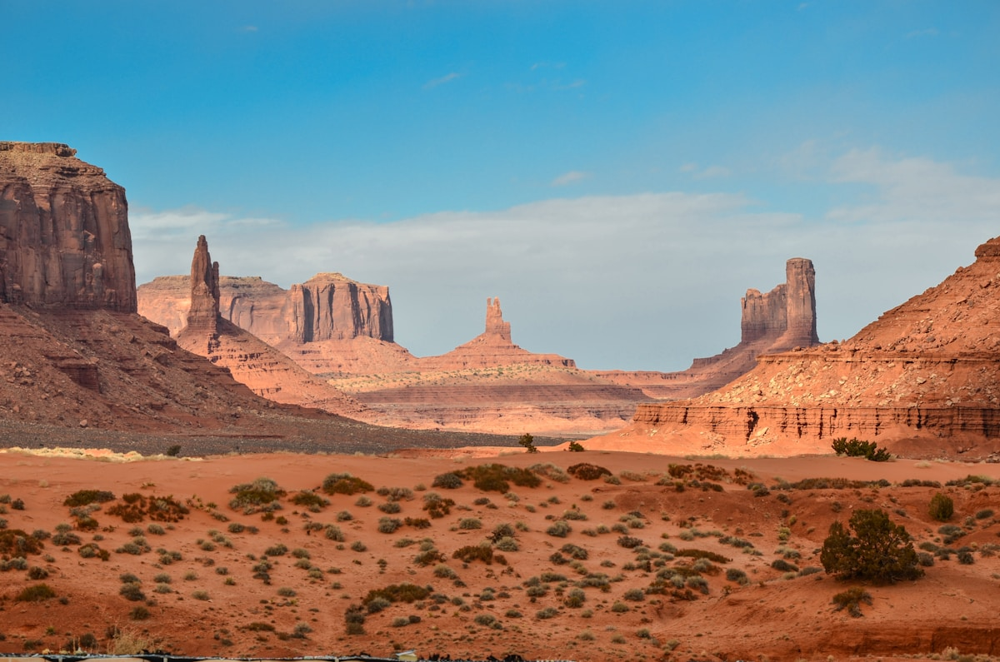

# Hydra

Hydra is a charming, car-free Greek island in the Saronic Gulf, just 1.5-2 hours by ferry from Athens. Famous for its picturesque harbor lined with 18th-century stone mansions, the island has a timeless quality where donkeys replace cars and the pace of life slows to a gentle rhythm. The island has long attracted artists, writers, and celebrities—from Leonard Cohen who lived here in the 1960s to Picasso and The Rolling Stones.

## Who This is For

**All three couples** would enjoy Hydra, making it an excellent option for the "together" portion of the trip:

- **Andy and Kathy**: The relaxed atmosphere and easy ferry access from Athens make it cruise-like without the hassle. The harbor cafés are perfect for people-watching, and getting around by foot or water taxi eliminates any driving stress.

- **Ryan and Toni**: Exceptional photography opportunities at every turn—the harbor at sunrise, donkeys carrying goods through narrow lanes, whitewashed buildings against blue water. Several upscale dining options (Omilos, Téchnē, Mikra Anglia) offer the fine dining experience they enjoy, while traditional tavernas like Xeri Elia (Douskos) provide authentic local favorites. The swimming spots like Spilia offer clear blue water typical of the Saronic Gulf. **This is a new destination for Toni** (not one of her previous Greece visits), offering fresh exploration. Note: The island has minimal museums, which works well for Toni's preference—instead, the experience is about atmosphere, dining, and photography.

- **Donna and Travis**: The bohemian vibe, swimming spots, and Leonard Cohen heritage add cultural depth. Easy day trip from Athens if time is limited. **Note for Donna's family**: While the car-free atmosphere is peaceful, the island does require walking—some paths are uneven or hilly. For family members with mobility concerns (the two women in their 80s), the harbor area is mostly flat and offers the best people-watching, dining, and atmosphere without requiring extensive walking. Water taxis can help reach beaches without climbing. The lack of schedules and leisurely café culture fits their preference for flexibility.

## Reasons to Choose

- **No cars or motorbikes**: Peaceful atmosphere, pedestrian-friendly exploration
- **Easy access from Athens**: 1-2 hour ferry ride from Piraeus port, multiple daily departures
- **Perfect October timing**: Pleasant weather, warm seas, fewer crowds than summer
- **Variety of activities**: Museums, hiking, swimming, excellent dining—all without intensity
- **Excellent dining scene**: From traditional tavernas to upscale Greek cuisine
- **Unique photo opportunities**: Harbor scenes, donkeys, historic architecture, sunset views
- **Relaxing pace**: Ideal for people-watching and unwinding
- **Historical and cultural richness**: Museums, 18th-century mansions, Leonard Cohen heritage

## Top Activities

### Harbor & Town Exploration
- Wander the cobblestone lanes of Hydra Town (Chora)
- Watch fishermen unload their catch at sunrise
- Explore the historic Kiafa neighborhood above the harbor
- Visit the 400-year-old Rafalias Pharmacy

### Museums & Culture
- **Lazaros Koundouriotis Historical Mansion** (€10) - 18th-century furnishings and Greek independence artifacts
- **Historical Archives Museum** (€5) - Naval history and ship figureheads
- **Ecclesiastical Museum** - Orthodox religious art

### Swimming & Beaches
- **Spilia & Hydronetta** - Swimming platforms near town, direct water access
- **Kamini** - Family-friendly pebble beach, 15-minute walk from harbor
- **Vlychos & Plakes** - Quiet beaches along the coast path
- **Agios Nikolaos** - Beautiful green waters, accessible by kayak

### Hiking
- **Windmills at Agios Athanasios** - Easy walk with Saronic Gulf views
- **Monastery of Prophet Elias** - 1-hour hike to panoramic island views
- **Coast path to Kamini and Vlychos** - Scenic waterfront walk

### Dining Highlights
- **Omilos** - Upscale harbor dining with celebrity history
- **Téchnē** - Modern Greek cuisine with courtyard seating
- **Xeri Elia (Douskos)** - Traditional taverna, Leonard Cohen's former haunt
- **Pirofani** - Hidden gem in Kamini, authentic Greek cooking
- **Tassia's Tavern** - Beach restaurant at Plakes

### Leonard Cohen Heritage
- Visit his former home on Leonard Cohen Street
- Memorial bench on the path to Kamini

## Details

### Suggested Time
1-2 full days is ideal. Can be done as a day trip from Athens, but an overnight stay allows for a more relaxed experience, sunset drinks, and morning harbor exploration.

### Best for October 2026
October is excellent timing—warm enough for swimming (sea temperatures around 22-23°C), pleasant hiking weather, and significantly fewer tourists than summer months. Some seasonal businesses may have reduced hours, but core restaurants and attractions remain open.

### Tips
- Bring cash—many shops and smaller restaurants prefer euros
- Pack water shoes for pebble beaches
- Arrive at Piraeus port 1 hour before ferry departure
- Book popular restaurants in advance (Téchnē accepts online reservations)
- Water taxis can reach remote beaches and coves

## Photos

*Aerial view of Hydra's crescent-shaped harbor, showing the amphitheater layout of whitewashed buildings rising from the Aegean Sea*

*Traditional stone-built houses with red-tiled roofs line Hydra's narrow whitewashed streets*

*Donkeys serve as the primary means of transport on car-free Hydra island, carrying supplies through the narrow cobblestone streets*

*Swimmers dive from concrete platforms and rocks at Spilia, Hydra's iconic bathing spot just minutes from the harbor*

*Golden hour at Hydra harbor, as the sun sets over the Aegean Sea illuminating the neoclassical architecture*

*Harborfront restaurants and cafes offer prime people-watching spots along Hydra's crescent-shaped port*

## Logistics

**Google Maps**: [Hydra, Greece](https://www.google.com/maps/place/Hydra,+Greece/)

### Getting There from Athens
- **Ferry from Piraeus Port**: 1h 5min to 1h 30min, €28-42 one-way
- **Departures**: Multiple daily ferries (8:30am - 7:30pm)
- **Ferry operators**: Hellenic Seaways, Alpha Lines, Magic Sea Ferries
- **To Piraeus**: Metro Line 1 from central Athens (20-30 min), €4.20 for 24-hour ticket

### On the Island
- **Walking**: Primary mode of transport in town
- **Water taxis**: For beaches and coastal villages
- **Donkeys**: Island tradition, used for luggage and supplies

## References

- [Discover Greece - Hydra](https://www.discovergreece.com/attica/hydra)
- [On the Luce - Things to Do in Hydra](https://www.ontheluce.com/best-things-to-do-in-hydra-greece/)
- [On the Luce - Restaurants in Hydra](https://www.ontheluce.com/restaurants-in-hydra-greece/)
- [Ferryhopper - Athens to Hydra](https://www.ferryhopper.com/en/ferry-routes/direct/athens-to-hydra)
- [TripAdvisor - Hydra Restaurants](https://www.tripadvisor.com/Restaurants-g189493-Hydra_Saronic_Gulf_Islands_Attica.html)
- [Greeka - Hydra Travel Guide](https://www.greeka.com/saronic/hydra/)
